# Footprint

지도에 마커를 추가하고, 기록할 수 있는 앱입니다. 제목, 카테고리, 함께한 사람, 사진, 내용 등을 추가할 수 있습니다. 만들어 낸 마커는 여행탭에서 그룹별로 묶어서 관리할 수 있습니다.
localization이 적용되어 있어 한글, 영어가 사용이 가능하고, google maps를 사용해서 한국뿐만 아니라 전 세계에서도 사용 할 수 있습니다.

#### 제공기능

-   지도 및 마커 표시
-   노트 및 여행 기록 생성, 추가, 삭제
-   저장된 노트 그룹화(여행)
-   즐겨찾기
-   장소 검색
-   노트 조회 필터링
-   휴지통 기능(복원 및 30일 후 완전 삭제)
-   이메일로 문의하기
-   영어/한국어

### 지도

마커를 추가하고, 추가된 마커들을 볼 수 있습니다. 또한, 이 페이지에서 마커를 추가, 삭제, 수정할 수 있습니다. 상단바를 통해 장소를 검색해서 클릭하면 해당 위치로 지도가 변화합니다. 상단 검색바는 설정 탭에서 on/off가 가능합니다. 마커를 클릭하면 저장된 노트를 bottomSheet형태로 볼 수 있습니다. 노트는 삭제하면 휴지통에 30일간 보관된 후 사라집니다.  
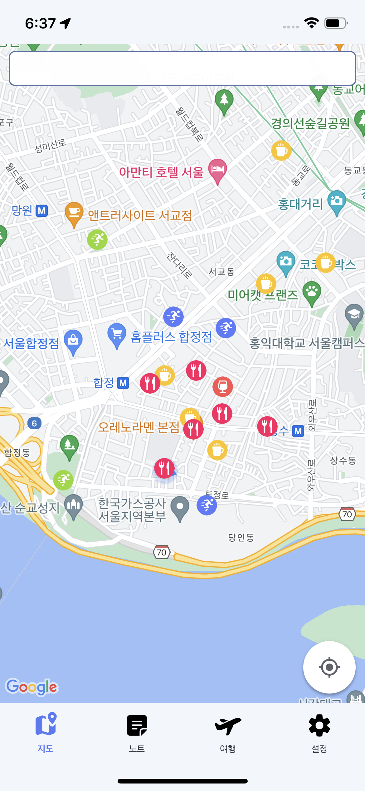
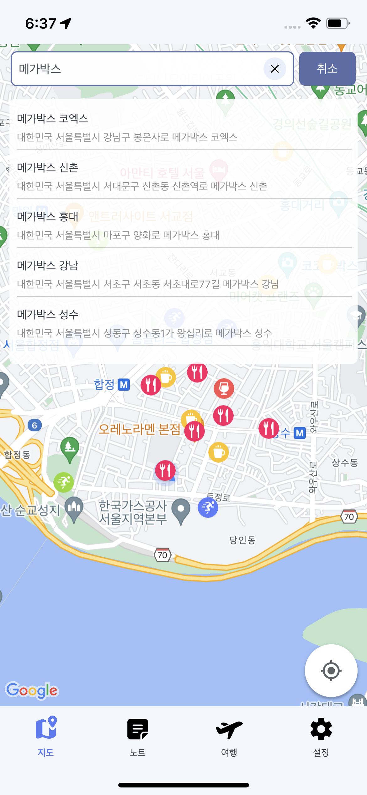
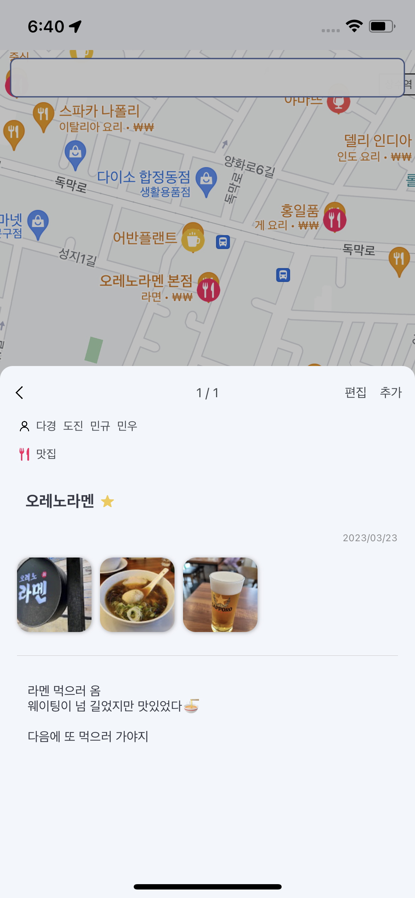
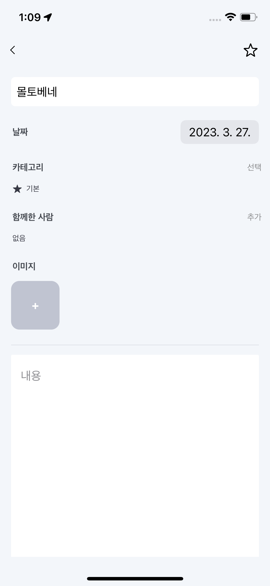  
지도에는 google maps sdk를, 위치 검색에는 google places sdk를 사용하였고, json데이터를 받아서 필요한 data만 가공하여 ui에 표시하였습니다.

### 노트 목록

모든 노트를 볼 수 있습니다. 필터기능을 통해 함께한 사람과 카테고리별로 필터를 해서 볼 수 있습니다.  
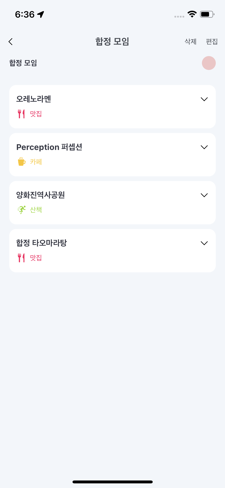
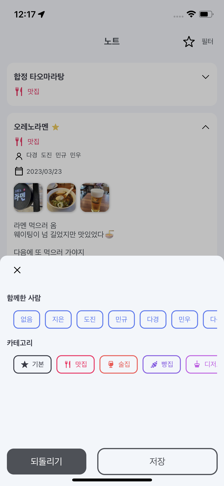

### 여행 목록

노트를 그룹별로 묶어 여행(그룹)으로 관리 할 수 있습니다. 노트 순서를 자유롭게 정할 수 있고, 제목, 내용, 날짜, 색상 등을 정할 수 있습니다. 여행기록은 삭제하면 휴지통에 30일간 보관된 후 사라집니다.  
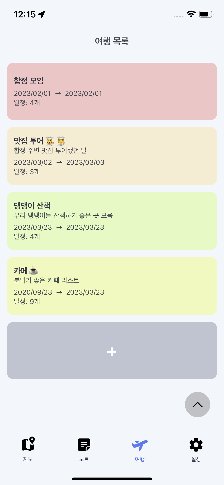

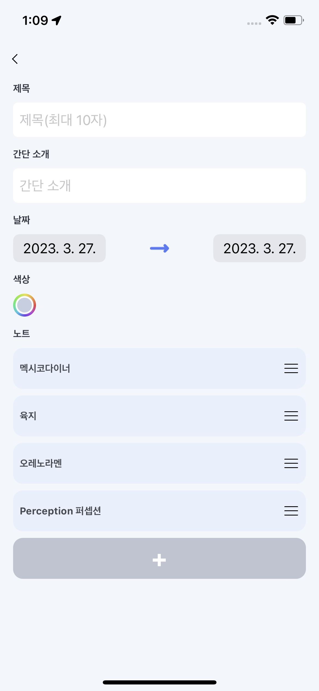

### 설정

설정 탭에서는 지도탭의 상단바 표시 여부, 휴지통(노트, 여행), 권한(카메라, gps, 알림 등)등을 확인할 수 있습니다. 또한, 함께한 사람과 카테고리를 추가, 수정, 삭제 등을 할 수 있습니다. 문의할 사항은 문의하기 항목을 통해 개발자에게 이메일을 보낼 수 있습니다.  
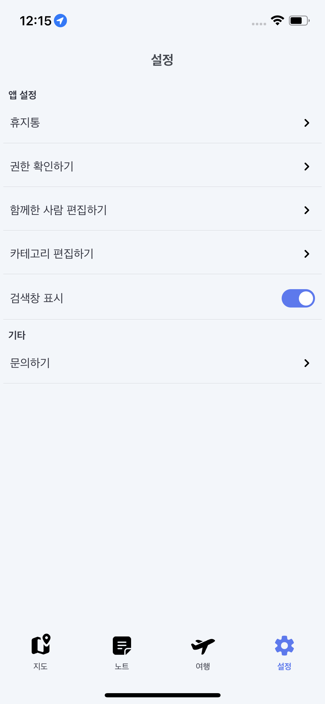
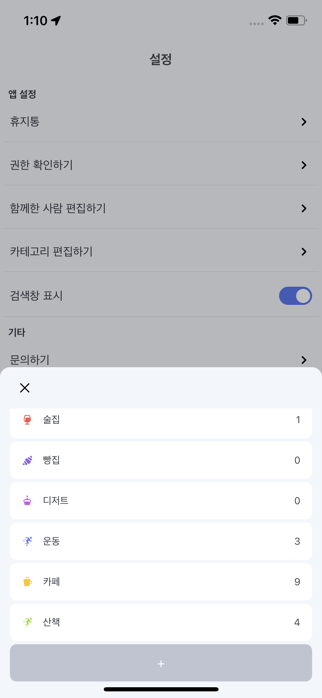
  
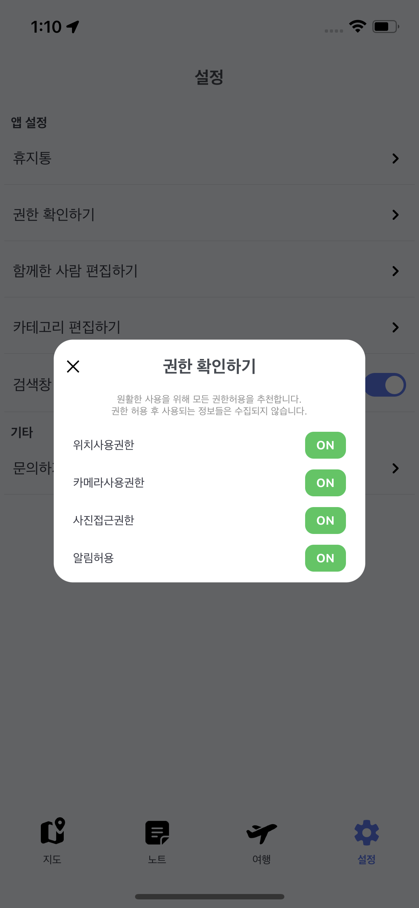

### Trouble Shooting

1. 장소 검색 api를 호출하는 시점  
   지도의 상단바에 장소를 검색하면 관련 장소를 리스트로 출력하고, 리스트내의 아이템을 클릭하면 해당 위치로 카메라를 옮기는 로직이 있습니다. 이때 언제 api를 호출해야하는지에 대한 고민이 있었습니다. 저는 다음과 같은 방법을 생각해보았습니다.

   > - 글자를 입력할 때마다 자동으로 api를 호출
   >   → 한 장소를 검색하는데도 너무 많은 api호출이 일어나게 되어 과금될 위험
   >   → 계속 리스트가 바뀌면 정신없어서 좋지 않은 경험
   >    
   > - 사용자가 **검색 버튼**을 눌러 api를 호출
   >   → 사용자가 정확한 장소를 알지 못하면 계속해서 버튼을 클릭해서 확인해야 함 ⇒ 불편

   따라서, 검색버튼이 없이 적당한 시점에 자동으로 api를 호출할 방법을 찾아야 했습니다. 그래서 저는 타이머를 사용했습니다. 사용자가 글자를 입력하기 시작하면 타이머를 설정하고, 글자 입력을 멈췄을 때 3초후에 api를 호출했습니다. 사용자가 취소버튼을 누르거나, 전체 삭제 버튼을 누르면 타이머가 종료됩니다. 또한, 글자입력을 멈추었는데 타이머가 종료되기전에 다시 입력을 시작하면 해당 타이머를 종료하여 다시 글자입력을 멈출때까지 작동시키지 않았습니다. 그리고 사용자가 입력이 끝났는데 3초간 아무런 리스트가 나오지 않으면 오류라고 생각할 수 있기때문에, 타이머가 돌게되면 progressing하는 Lottie를 띄워서 작업이 진행중임을 표시했습니다.
    

2. PHAsset을 이용한 이미지 로드시 이미지가 로드되지 않거나 새로고침이 작동하지 않는 이슈  
   이미지 로드후 view에 띄울 때 빠르게 UI를 띄우기 위해 Pagination을 구현했고, refresh scrollView를 사용하여 사진 리스트를 다시 로드할 수 있도록 하였습니다. 이미지 로드는 오래걸리는 작업이기 때문에 백그라운드 스레드에서, 불러온 이미지를 view에 그리는 것은 메인스레드에서 작업하였습니다.
   이 경우에서 이미지 로드할 때 로드하는 이미지의 범위가 올바르게 작동하지 않아서 중복된 이미지가 로드되거나, 범위를 넘어가서 크래시가 발생했습니다. 상황은 다음 두가지와 같습니다.

   > 1. 스크롤을 빠르게 내려 백그라운드에서 이미지 로딩 중에 또 다음 이미지를 로드할 때
   > 2. 이미지 로딩중에 유저가 새로고침을 시도할 때

   이 문제를 해결하기 위해서 변수를 두어 이미지 리스트에는 한번에 하나의 로직만 접근가능하도록 했습니다. `isLoading` 변수를 사용하여 이미지관련 작업이 진행중인 경우에는 `true`를, 작업이 끝나서 다른 이미지 작업(ex. 이미지 변수 배열 초기화, 추가 이미지 로드)이 가능한 경우는 `false`로 설정하였습니다. 이 `isLoading`변수가 이미지 관련 작업을 시작하기전 `true`인 경우에는 작업을 시작하지 않고, `false`인 경우에만 작업을 시작할 수 있도록 하여 이미지 로드가 정상적으로 진행되도록 하였습니다.

## Skill, API, Library

-   Swift, SwiftUI
-   MVVM
-   Coordinator pattern
-   [Google Maps API](https://developers.google.com/maps/documentation?hl=ko)
    -   장소 검색: [Places SDK](https://developers.google.com/maps/documentation/places/ios-sdk?hl=ko)
    -   지도 및 마커 표시: [Maps SDK](https://developers.google.com/maps/documentation/ios-sdk?hl=ko)
-   [Realm](https://github.com/realm/realm-swift)
-   [Alamofire](https://github.com/Alamofire/Alamofire)
-   [kingFisher](https://github.com/onevcat/Kingfisher)
-   [FittedSheets](https://github.com/gordontucker/FittedSheets)
-   [Lottie](https://github.com/airbnb/lottie-android)
-   [SwiftUIPager](https://github.com/fermoya/SwiftUIPager)
-   [SwiftUIPullToRefresh](https://github.com/globulus/swiftui-pull-to-refresh)

## TODO

-   지도 메인에서 필터링: 카테고리별/여행별 마커만 표시
-   여행 내에 카테코리별로 볼 수 있는 기능
-   서버 연동해서 통신 구현
-   UI/UX 고민해보기 (현재 앱 사용이 편리하지 않음)

## 라이센스

아이콘: [icons8](https://icons8.com/icons/)
