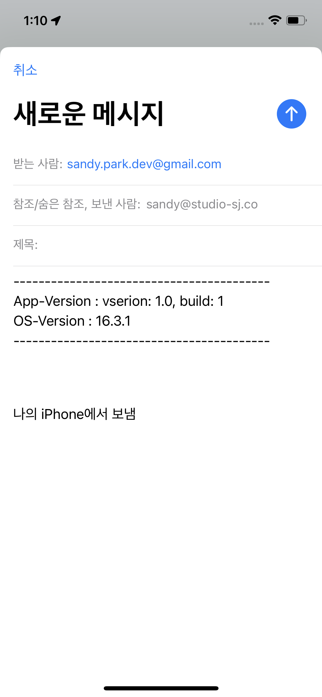

# Footprint

지도에 마커를 추가하고, 기록할 수 있는 앱입니다. 제목, 카테고리, 함께한 사람, 사진, 내용 등을 추가할 수 있습니다. 만들어 낸 마커는 여행탭에서 그룹별로 묶어서 관리할 수 있습니다.
localization이 적용되어 있어 한글, 영어가 사용이 가능하고, google maps를 사용해서 한국뿐만 아니라 전 세계에서도 사용 할 수 있습니다.

#### 제공기능

-   지도 및 마커 표시
-   노트 및 여행 기록 생성, 추가, 삭제
-   저장된 노트 그룹화(여행)
-   즐겨찾기
-   장소 검색
-   노트 조회 필터링
-   휴지통 기능(복원 및 30일 후 완전 삭제)
-   이메일로 문의하기
-   영어/한국어

### 지도

마커를 추가하고, 추가된 마커들을 볼 수 있습니다. 또한, 이 페이지에서 마커를 추가, 삭제, 수정할 수 있습니다. 상단바를 통해 장소를 검색해서 클릭하면 해당 위치로 지도가 변화합니다. 상단 검색바는 설정 탭에서 on/off가 가능합니다. 마커를 클릭하면 저장된 노트를 bottomSheet형태로 볼 수 있습니다. 노트는 삭제하면 휴지통에 30일간 보관된 후 사라집니다.  

  
지도에는 google maps sdk를, 위치 검색에는 google places sdk를 사용하였고, json데이터를 받아서 필요한 data만 가공하여 ui에 표시하였습니다.

### 노트 목록

모든 노트를 볼 수 있습니다. 필터기능을 통해 함께한 사람과 카테고리별로 필터를 해서 볼 수 있습니다.  

### 여행 목록

노트를 그룹별로 묶어 여행(그룹)으로 관리 할 수 있습니다. 노트 순서를 자유롭게 정할 수 있고, 제목, 내용, 날짜, 색상 등을 정할 수 있습니다. 여행기록은 삭제하면 휴지통에 30일간 보관된 후 사라집니다.  

### 설정

설정 탭에서는 지도탭의 상단바 표시 여부, 휴지통(노트, 여행), 권한(카메라, gps, 알림 등)등을 확인할 수 있습니다. 또한, 함께한 사람과 카테고리를 추가, 수정, 삭제 등을 할 수 있습니다. 문의할 사항은 문의하기 항목을 통해 개발자에게 이메일을 보낼 수 있습니다.  

  

## Skill, API, Library

-   Swift, SwiftUI
-   MVVM
-   Coordinator pattern
-   [Google Maps API](https://developers.google.com/maps/documentation?hl=ko)
    -   장소 검색: [Places SDK](https://developers.google.com/maps/documentation/places/ios-sdk?hl=ko)
    -   지도 및 마커 표시: [Maps SDK](https://developers.google.com/maps/documentation/ios-sdk?hl=ko)
-   [Realm](https://github.com/realm/realm-swift)
-   [Alamofire](https://github.com/Alamofire/Alamofire)
-   [kingFisher](https://github.com/onevcat/Kingfisher)
-   [FittedSheets](https://github.com/gordontucker/FittedSheets)
-   [Lottie](https://github.com/airbnb/lottie-android)
-   [SwiftUIPager](https://github.com/fermoya/SwiftUIPager)
-   [SwiftUIPullToRefresh](https://github.com/globulus/swiftui-pull-to-refresh)

## TODO

-   지도 메인에서 필터링: 카테고리별/여행별 마커만 표시
-   여행 내에 카테코리별로 볼 수 있는 기능
-   서버 연동해서 통신 구현
-   UI/UX 고민해보기 (현재 앱 사용이 편리하지 않음)

## 라이센스

아이콘: [icons8](https://icons8.com/icons/)
